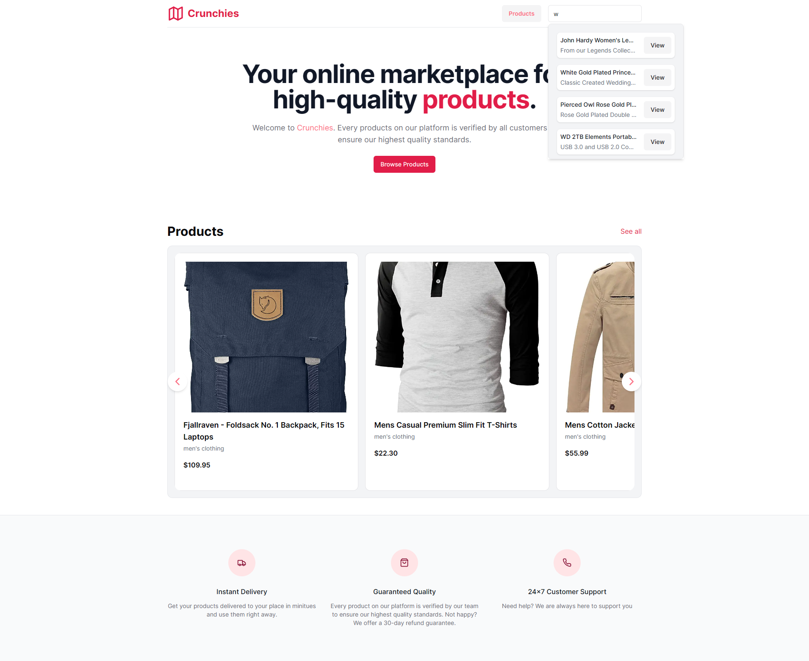
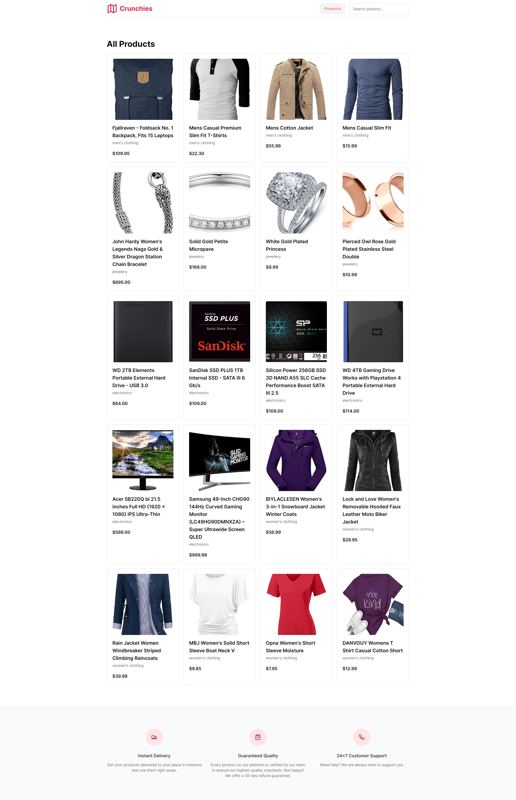
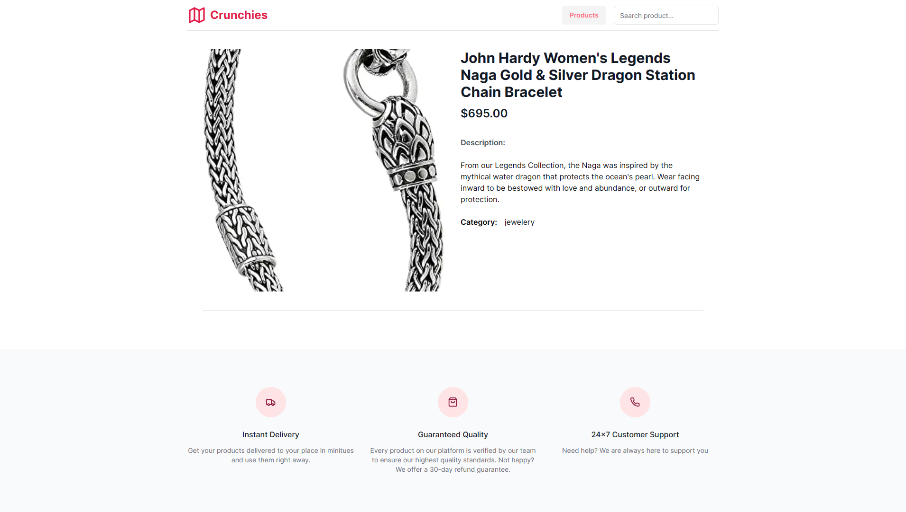

# Front-End Development Intern

This is an application that fetches data from ‘https://fakestoreapi.com/products’ and displays the products in the application. It allows users to view product details upon selection.

## Features

- Custom product carousel
- On-type product searching
- Responsive
- Displaying all products fetched from external API
- Single product detail.

## Tech Stack

**Client:** React, NextJs, TypeScript, TailwindCSS, Shadcn/UI

**API:** https://fakestoreapi.com/products

## Installation

Install this project with npm

```bash
  npx create-next-app@latest ./
  npx shadcn-ui@latest init
```

## Environment Variables

To run this project, you will need to add the following environment variables to your .env file

`NEXT_PUBLIC_API_URL="https://fakestoreapi.com/products"`

## Deployment

```bash
munchies-task.vercel.app
```

## Screenshots





